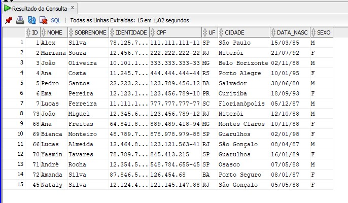
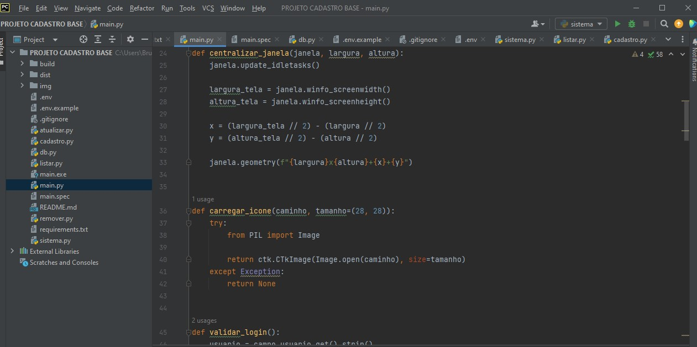
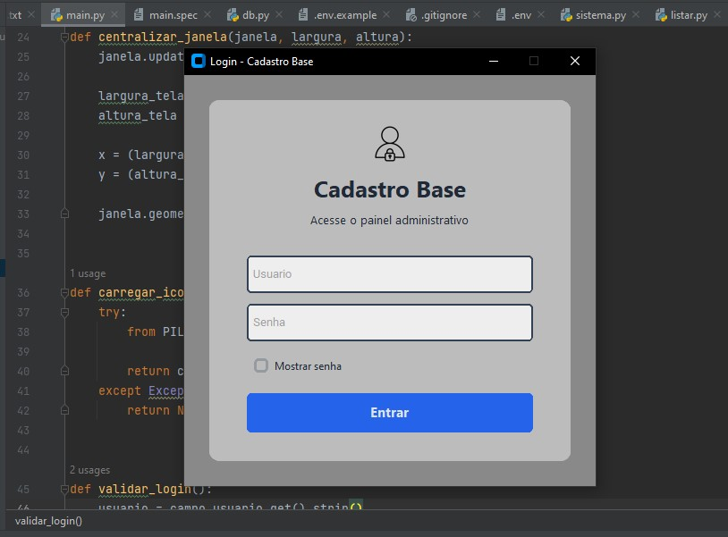
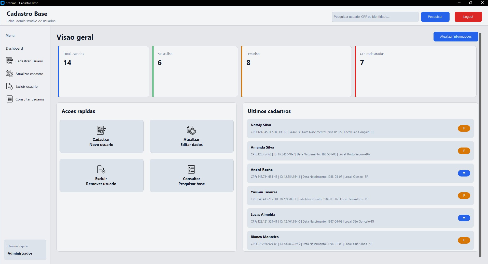
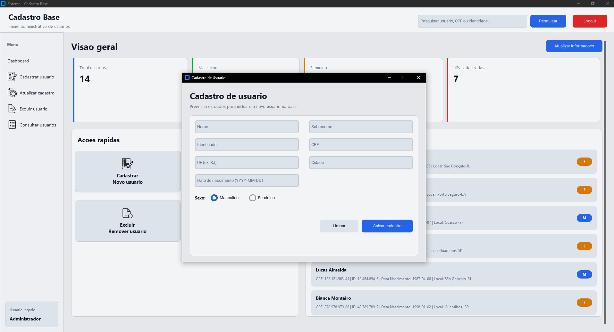
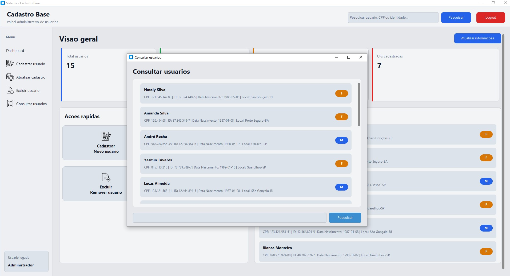
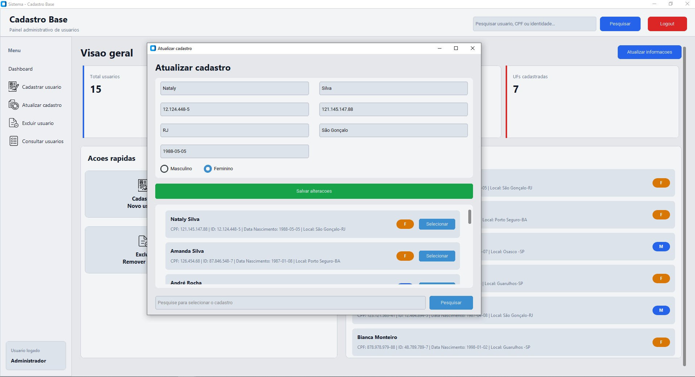
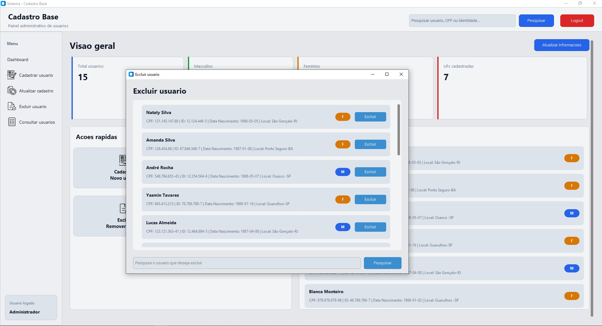
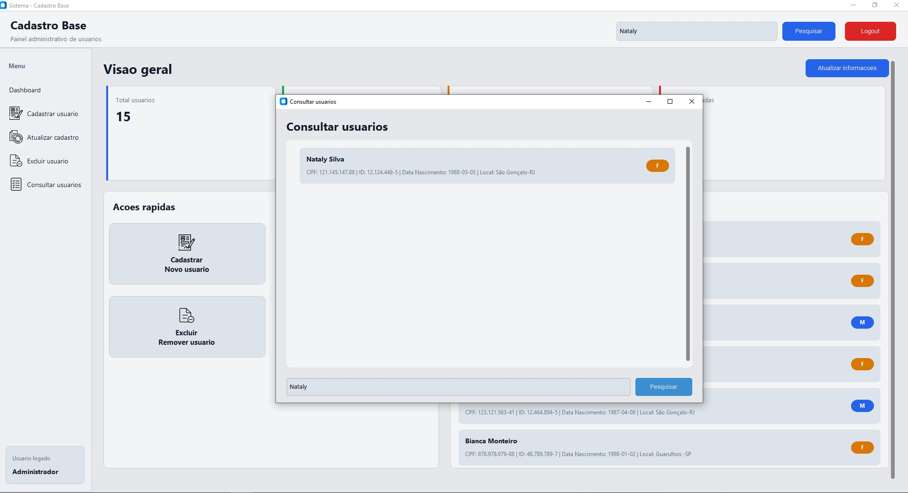

# Sistema de Cadastro de Usuários

Sistema desktop desenvolvido em Python com interface gráfica utilizando CustomTkinter e conexão em de dados.

O projeto foi desenvolvido com foco em organização de código, boas práticas de programação e integração com banco de dados.

## DB



## Main



## Login



## Tela Sistema



## Insert



## Select



## Update



## Delete



## Find


---

## Funcionalidades

- Login de usuários
- Cadastro de registros
- Atualização de informações
- Exclusão de registros
- Listagem de dados
- Interface gráfica
- Integração com Base de Dados

---

## Tecnologias

- Python
- CustomTkinter
- Base de Dados
- python-oracledb
- python-dotenv
- Pillow
- PyInstaller

---

## Estrutura do Projeto

```
Projeto/
│
├── main.py
├── db.py
├── cadastro.py
├── sistema.py
├── atualizar.py
├── remover.py
├── listar.py
├── img/
├── requirements.txt
└── README.md
```

---

## Como executar

### Clone o projeto

```bash
git clone https://github.com/SEU_USUARIO/SEU_REPOSITORIO.git
```

### Instale as dependências

```bash
pip install -r requirements.txt
```

### Configure o banco

Crie um arquivo `.env` na raiz do projeto utilizando como base o arquivo `.env.example`.

Exemplo:

```
DB_USER=usuario
DB_PASSWORD=senha
DB_DSN=localhost:1521/XEPDB1
```

### Execute

```bash
python main.py
```

---

## Executável

O projeto também possui uma versão compilada para Windows disponível.


---

## Autor

Bruno Leite